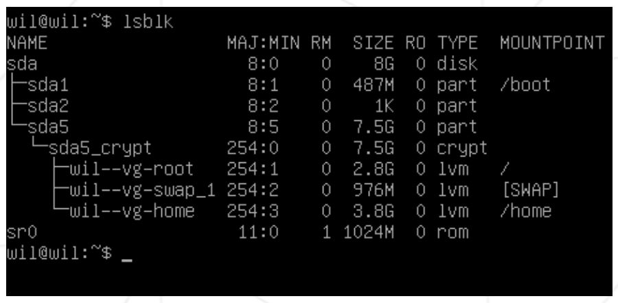
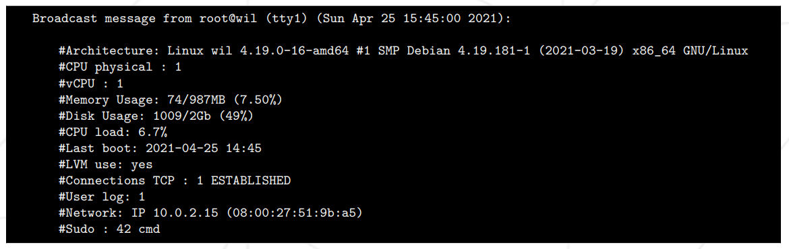
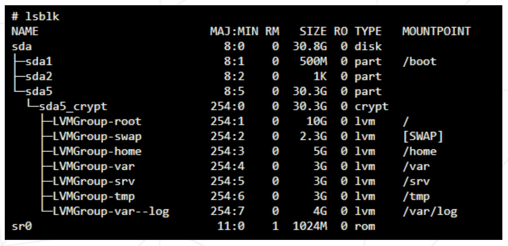

<a name="readme-top"></a>
<div align="center">

# Born2beRoot 󰹑

> an introduction to _**the wonderful world of virtualization**_.

<p>
    
    
    
    
</p>

</div>


# About

This project teaches how to setup a server implementing strict rules. To complete this project a **Virtual Machine** (using **VirtualBox** or **UTM**) must be build following specific instructions.

___

## Constraints
- [ ] Only minimum services must be installed;
- [ ] X.org or any other equivalent graphics servers are forbidden;
- [ ] Only either the latest stable version of **Debian** or **Rocky** should be used;
- [ ] **Firewall**
> - For **Debian** **AppArmor** must be running at startup;
> - For **Rocky**, **SELinux** must be launched at startup configured in accordance with the project's requirements;
- [ ] At least 2 encrypted partitions must be created using **LVM**;



- [ ] An **SSH** service must be running on port 4242 only;
- [ ] For security reasons it must NOT be possible to connect using **SSH** as `root`;
- [ ] The operating system must be configured with a **Firewall**:
> - In the case of Debian, the **UFW** firewall leaving only port 4242 open.
> - In the case of Rocky, **firewalld**;
- [ ] The firewall must be active at startup;
- [ ] The **hostname** of the virtual machine should be your login with 42 appended;
- [ ] Know how to modify the **hostname**;
- [ ] Implement a strong password policy;
- [ ] Install and configure **sudo** following strict rules;
- [ ] Besides `root` user, a user with your login as username must be defined;
- [ ] This user must belong to `user42` and **sudo** groups;
- [ ] Know the difference between **apt** and **aptitude**;

___
## Password Policy

- [ ] The password must expire every 30 days;
- [ ] Minimum number of days before modifying the password is allowed should be set to 2;
- [ ] The user must be sent a message 7 days before their password expires;
- [ ] The password must be at least 10 characters long;
- [ ] Must contain an uppercase letter, a lowercase letter, and a number;
- [ ] It must not contain more than 3 consecutive identical characters;
- [ ] The password must note contain the name of the user;
- [ ] The password must have at least 7 characters that are not part of the former password (Doesn't apply to the `root` password);

___
## Configuration Setup

To create a strong configuration for a **sudo** group the following requirements must be met:

- [ ] Authentication using **sudo** has to be limited to 3 attempts in the event of an incorrect password;
- [ ] A custom message has to be displayed if an error due to a wrong password occurs when using **sudo**;
- [ ] Each action using **sudo** must be archived, both inputs and outputs. The log file must be saved in the `/var/log/sudo/` folder;
- [ ] **TTY mode** has to be enabled for security reasons;
- [ ] Also for security reasons, the path that can be used by **sudo** must be restricted;
Ex.: `/usr/local/sbin:/usr/local/bin:/usr/sbin:/usr/bin:/sbin:/bin:/snap/bin`

___
## Monitoring Script

A simple script written in **bash** launched at startup, should display information on the terminal every 10 minutes (check out **wall**):

- [ ] The architecture of your operating system and its kernel version;
- [ ] The number of physical processors;
- [ ] The number of virtual processors;
- [ ] The current available **RAM** on the server and its utilization rate as a percentage;
- [ ] The current available **Memory** on the server and its utilization rate as a percentage;
- [ ] The current utilization of the current processor as a percentage;
- [ ] The date and time of the last reboot;
- [ ] Whether **LVM** is active or not;
- [ ] The number of active connections;
- [ ] The number of users using the server;
- [ ] The **IPv4** address of your server and its **MAC Address**;
- [ ] The number of commands executed with the **sudo** command;
- [ ] The banner is optional;
- [ ] No errors must be visible;
- [ ] It must be possible to interrupt the script without modifying it;

> [!NOTE]
> Take a look at **crontab**;

An example of the script's output:


___

## Bonus

- [ ] Set up partitions as to match a similar structure to the one below:



- [ ] Set up a functional **WordPress** website with the following services: **lighttpd**, **MariaDB** and **PHP**;
- [ ] Set up a service of your choice that you think is useful (**NGINX** / **Apache2** excluded!)

> [!Important]
> To complete the bonus part, there is the possibility of setting up extra services. In this case, you may open more ports to suit your needs. Of course, the **UFW**/**Firewalld** rules has to be adapted accordingly.

___

___
___
# Walkthrough

## Installing the Virtual Machine 🛠
- [x] Open **VirtualBox** and click `new`;
- [x] Give the VM a name;
- [x] Store the VM inside `/sgoinfre/` directory;
- [x] Select total amount of RAM to reserve for the machine;
- [x] Create a new hard drive for the VM;
- [x] Make the hard drive a **VDI** archive;
- [x] Make the hard drive's memory dynamically allocated;
- [x] Allocate 30 GB to account to account for the bonus:
> [!Important]
> **VM**'s size in Bytes:
>
> `33079636992 B`
- [x] Click `Create`;
- [x] Go to `Settings` and click on `Storage`;
- [x] Select the empty drive 💿 and click `Choose a disk file`;
- [x] Select the `Debian ISO`and click `Open`, then click `ok`;
- [x] Start the VM;
___
## Installing Debian 🌀

- [x] Select `Install` from the Debian GNU/Linux menu;
- [x] Set the language to `English`;
- [x] Set the location to `Other`;
- [x] Set continent to `Europe`;
- [x] Set country to `Portugal`;
- [x] Set locales to `United States`;
- [x] Set keyboard to `American English`;
- [x] Set a `hostname` for the VM:
> [!Important]
> **hostname**'s name:
>
> `passunca42`;
- [x] Leave network settings blank (not required by the subject);
- [x] Set password for `root` user;
> [!IMPORTANT]
> `Root` Password:
>
> `Zedro42beRoot`
- [x] Set user full name for user: `passunca`;
- [x] Set user username: `passunca`;
- [x] Set user password;
> [!IMPORTANT]
> `User` Password:
>
> `Zedro42beUser`
- [x] Set clock to Lisbon;
___
## Partitioning the Disk (Bonus)
[[Disk Partitions]]
- [x] Select `Manual` partition method;
- [x] Select the available volume;
> [!Note]
> The volume name may differ from system to system. Example:
>
> `SCSI1 (0,0,0) (sda) - 33.1 GB ATA VBOX HARDDISK`
- [x] Confirm the creation of a new empty partition;
___
#### Create Primary Partition
- [x] Select `FREE SPACE`;
- [x] Create a new partition;
- [x] Make the partition size `500m` in bytes:
> [!Important]
> Primary Partition size in Bytes
>
> `525336576 B`
- [x] Set partition type to `Primary`;
- [x] Set location for the new partition to `Beginning`;
- [x] Set Mount point: `/boot`;
- [x] Select `Done setting up the partition`;

___
#### Create Logical Partition
- [x] Select `FREE SPACE` again;
- [x] Create a new partition;
- [x] Set the size to `max`;
>[!Important]
> Logical Partition size in Bytes
> 
> `32554300416 B`
- [x] Set partition type to `Logical`;
- [x] Set Mount point to: `Do not mount it`;
- [x] Select `Done setting up the partition`;

___
#### Encrypting Volumes
- [x] Click `Configure encrypted volumes`;
- [x] Accept confirmation message;
- [x] Click `Create encrypted volumes`;
- [x] Select device `/dev/sda5`for encryption;
- [x] Select `Done setting up the partition`;
- [x] Select `Finish`;
- [x] Accept confirmation message to encrypt;
- [x] Hit `Cancel` because there's nothing to encrypt;
- [x] Set encryption passphrase;
> [!IMPORTANT]
> `user` Password
> 
> `Zedro42beCrypt`

___
#### Configure Logical Volume Manager
- [x] Click `Configure Logical Volume Manager`;
- [x] Accept confirmation message;
- [x] Click `Create volume group`;
- [x] Set the name to `LVMGroup`;
- [x] Select partition to store the group: `/dev/mapper/sda5_crypt`;

___
##### Create Logical Partitions
- [x] Select `Create Logical Volume`;
- [x] Select group: `LVMGroup`;
- [x] Set the name of the logical volume: `root`;
- [x] Set it's size to: `10g`;
>[!Important]
> `root` size in Bytes
>
> `10737418240 B`
- [x] Select `Create logical volume`;
- [x] Select group: `LVMGroup`;
- [x] Set the name of the logical volume: `swap`;
- [x] Set it's size to: `2.3g`;
> [!Important]
> `swap` size in Bytes
>
> `2465607424 B`
- [x] Select `Create logical volume`;
- [x] Select group: `LVMGroup`;
- [x] Set the name of the logical volume: `home`;
- [x] Set it's size to: `5g`;
>[!Important]
> `home` size in Bytes
>
>`5368709120 B`
- [x] Select `Create logical volume`;
- [x] Select group: `LVMGroup`;
- [x] Set the name of the logical volume: `var`;
- [x] Set it's size to: `3g`;
> [!Important]
> `var` size in Bytes
>
>`3221225472 B`
- [x] Select `Create logical volume`;
- [x] Select group: `LVMGroup`;
- [x] Set the name of the logical volume: `srv`;
- [x] Set it's size to: `3g`;
> [!Important]
> `srv` size in Bytes
>
> `3221225472 B`
- [x] Select `Create logical volume`;
- [x] Select group: `LVMGroup`;
- [x] Set the name of the logical volume: `tmp`;
- [x] Set it's size to: `3g`;
> [!Important]
> `tmp` size in Bytes
>
> `3221225472 B`
- [x] Select `Create logical volume`;
- [x] Select group: `LVMGroup`;
- [x] Set the name of the logical volume: `var-log`;
- [x] Set it's size to: `4g`;
> [!Important] 
> `srv` size in Bytes
>
> `4294967296 B`
- [x] Click `Finish`to end the configuration of the logical volumes;
___

##### Setting Mount Points
- [x] Select partition #1, `home`;
- [x] Set `Use as` to `Ext4`;
- [x] Set Mount Point: `/home`;
- [x] Select `Done setting up the partition`;
- [x] Select partition #1, `root`;
- [x] Set `Use as` to `Ext4`;
- [x] Set Mount Point: `/`;
- [x] Select `Done setting up the partition`;
- [x] Select partition #1, `srv`;
- [x] Set `Use as` to `Ext4`;
- [x] Set Mount Point: `/srv`;
- [x] Select `Done setting up the partition`;
- [x] Select partition #1, `swap`;
- [x] Set `Use as` to `swap area`;

> [!Note] 
> Research **Swap Partition**

- [x] Select `Done setting up the partition`;
- [x] Select partition #1, `tmp`;
- [x] Set `Use as` to `Ext4`;
- [x] Set Mount Point: `/tmp`;
- [x] Select `Done setting up the partition`;
- [x] Select partition #1, `var`;
- [x] Set `Use as` to `Ext4`;
- [x] Set Mount Point: `/var`;
- [x] Select `Done setting up the partition`;
- [x] Select partition #1, `var-log`;
- [x] Set `Use as` to `Ext4`;
- [x] Set Mount Point: `Enter manually`;
- [x] Enter `/var/log`;
- [x] Select `Done setting up the partition`;
- [x] Click `Finish partitioning and write changes to disk;
- [x] Accept confirmation message;
- [x] Say **NO** to additional packages;
- [x] Select country;
- [x] Set Debian archive mirror package manager: `deb.debian.org`;
- [x] Leave HTTP proxy empty and click `Continue`;
- [x] Say **NO** to the popularity contest;
- [x] Remove all software options and press `Continue`;
- [x] Say `Yes` to the installation of **GRUB boot loader**;
- [x] Select device to install the bootloader: `/dev/sda (ata_VBOX_HARDDISK)`;
- [x] Select `Continue`;

> [!IMPORTANT]
> Research **Ext4**

___
## Virtual Machine Setup ⚙️
### Login into the system
- [x] Enter encryption password;
- [x] Enter user and password;
### Installing **sudo** & configuring groups and users
- [x] Switch user to `root`:
> => `su`
- [x] Insert `root` password;
- [x] To install **sudo** run:
> => `apt install sudo`;
- [x] Reboot the machine with the following command:
> => `sudo reboot`;
- [x] Login again with `user` and switch to `root`;
- [x] Check **sudo**'s version with the command:
> => `sudo -V`;

> [!Note]
> This command displays the currently installed version of [[sudo]] (and other extra info like which plugins are installed);

> [!Important]
> If the output is too large it can be redirected to a file with the following command: `sudo -V > file.txt`. Additionally the output could be piped `| more` to be conveniently displayed;

- [x] Create a new user;
> => `sudo adduser <login>`

> [!Important]
> User Credentials
> 
> login: `zedro`
> password: `Zedro42beUser`

- [x] Create a new group `user42`:
> => `sudo addgroup user42`;
- [x] Include `passunca` on both `sudo` and `user42` groups:
> => `sudo adduser <user> <groupname>`

>[!Important] 
> To check user groups and their users either:
>
> Switch user to `root`:
> => `getent group`;
> => `getent group <groupname>`;
>  > Filters `getent` output;
____
### Installing **SSH**
- [x] Update the system:
 => `sudo apt update`;
> [!Note] 
> Gets packages:
> -> `bookworm`,
> -> `bookworm-security`,
> -> `bookworm-updates`

- [x] Install **OpenSSH**:
> => `sudo apt install openssh-server`;
- [x] When asked for confirmation type `Y`;

> [!Note]
> To check the state of the system's **SSH** service:
> -> `sudo service ssh status`;
> The service must be shown as `Active`;

___
#### Installing **vim**
- [x] Run the command:
> => `sudo apt install vim`;

___
#### Configuring **SSH**
- [x] If not `root` switch to it with `su`;
- [x] Open `sshd_config` with vim:
> => `vim /etc/ssh/sshd_config`

> [!Note] 
> `sshd` – SSH server process
>
> `sshd` is the **OpenSSH** server process. It listens to incoming connections using the **SSH** protocol and acts as the server for the protocol. It handles user authentication, encryption, terminal connections, file transfers, and tunneling.
> - [sshd: OpenSSH server process | SSH Academy](https://www.ssh.com/academy/ssh/sshd)
> - [sshd\_config - How to Configure the OpenSSH Server?](https://www.ssh.com/academy/ssh/sshd_config)
> - [sshd\_config(5): OpenSSH SSH daemon config file - Linux man page](https://linux.die.net/man/5/sshd_config)

- [x] Set Port to `Port 4242`
- [x] Set `PermitRootLogin no`
- [x] Save changes and close file;
- [x] Open `ssh_config` with vim:
```sh
vim /etc/ssh/ssh_config
```

> [!Note] 
> `ssh_config` – **SSH** system-wide configuration file;
> - [ssh\_config(5): OpenSSH SSH client config files - Linux man page](https://linux.die.net/man/5/ssh_config)

- [ ] Set Port to `Port 4242`;
- [ ] Restart and update the **SSH** service:
```sh
sudo service ssh restart
```

- [ ] Check service's state with:
```sh
sudo service ssh status
```

___
### Connecting via **SSH**
- [ ] Get **VM**'s IP:
```sh
hostname -I
```
- [ ] Close the VM and go to `Settings`;
- [ ] Click on `Network`, then `Advanced`; 
- [ ] Change `Attached to:` from `NAT` to `Bridged Adapter`;
- [ ] Click `OK`;
- [ ] Re-open the **VM** and decrypt it:
- [ ] Open a terminal and connect to the **VM**:
```sh
ssh passunca@10.11.246.116 -p 4242
```
- [ ] To close the connection:
```sh
exit
```
___
### Close Unnecessary Connections

- [ ] Check system sockets:
> => `ss -tunlp`

> [!Important]
> `ss`'s **flags**
> - `-t` or `--tcp`: display **TCP** connections;
> - `-u` or `--udp`: display **UDP** connections;
> - `-n` or `--numeric`: Do not try to resolve service names into human-readable form. Show exact numeric values;
> - `-l` or `--listening`: Display only listening sockets;
> - [NetworkConfiguration - Debian Wiki](https://wiki.debian.org/NetworkConfiguration)

- [x] Get `ip` address:
- `ip --color addr`
- [x] Get System's Network Interfaces
 - `vim /etc/network/interfaces`
- [x] Editing it by setting `# The primary network interface` from `dhcp` to `static`:
```
iface enp0s inet static
	address xxx.x.x.x/xx
	gateway xxx.x.x.xxx
	netmask xxx.xxx.x.x
	dns
```
___
### Installing **git**
- [x] To install **git** run:
```sh
apt install git
```

> [!Note]
> [networking - UFW/IPTables: how to securely allow authenticated git access with github - Server Fault](https://serverfault.com/questions/370743/ufw-iptables-how-to-securely-allow-authenticated-git-access-with-github)
___
### Installing & Configuring **UFW** 🔥🧱

- [x] Install **UFW** packages:
> => `sudo apt install ufw`;
- [x] Start **UFW** using the command
> => `sudo ufw enable`;
- [x] Configure **Firewall** to accept connections on 4242 port
> => `sudo ufw allow 4242`;
- [x] Check the current state of the firewall
> => `sudo ufw status`;

> [!Note]
> Alternatively the firewall's state can be checked with
>
> => `sudo ufw status verbose`
> => `sudo ufw status numbered`
> ### Refs
> - [UFW: Common Firewall Rules and Commands – TecAdmin](https://tecadmin.net/ufw-common-firewall-rules-and-commands/)

___
### Configuring **sudo** policies and log
- [x] Create the following file:
> -> `touch /etc/sudoers.d/sudo_config`

> [!Note]
> This file will store the system's **sudo** policy

- [x] Open `sudo_config` to setup policy
> -> `vim /etc/sudoers.d/sudo_config`

- [x] Add the following Defaults to the file:
```
Defaults  passwd_tries=3
Defaults  badpass_message="Wrong password bruh, try again:"
Defaults  logfile="/var/log/sudo/sudo_config"
Defaults  log_input, log_output
Defaults  iolog_dir="/var/log/sudo"
Defaults  requiretty
Defaults  secure_path="/usr/local/sbin:/usr/local/bin:/usr/sbin:/usr/bin:/sbin:/bin:/snap/bin"
```

> [!Note]
> `passwd_tries`=> total tried for entering **sudo** password;
>
> `badpass_message` => Message to be printed when password is wrong;
>
> `logfile` => Set custom log file for **sudo**;
>
> `log_input, log_output` => What will be logged;
>
> `iolog_dir` => Path where I/O logs will be stored;
>
> `requiretty`=> Enables **sudo** invocation from a real **TTY** but not through methods such as **cron** or **cgi-bin**;
>
> `secure_path` => The **PATH** used for every command run with **sudo**:
>
> > - Used when a system admin doesn't trust **sudo** users to have a secure **PATH** environment variable;
> > - Separates `root path` from `user path`;

- [x] Create the following directory:
> - `mkdir /var/log/sudo`

> [!Note]
> This folder will store the system's **sudo** log

___
### Change **hostname**  (for the defense)
- [ ] Check current **hostname**:
> `hostnamectl`
- [ ] Change **hostname**:
> `hostnamectl set-hostname <hostname>`
- [ ] Edit **/etc/hosts**
> `sudo vim /etc/hosts`
- [ ] Change **old_hostname** to **new_hostname**
```sh
127.0.0.1 localhost
127.0.0.1 new_hostname
```
- [ ] Reboot and check for change:
```sh
sudo reboot hostnamectl
```
___
### Configuring Password Policy 🔑
- [x] Open `login.defs`:
> -> `vim /etc/login.defs`;
- [x] Set `PASS_MAX_DAYS`to 30;
- [x] Set `PASS_MIN_DAYS` to 2;
- [x] Set `PASS_WARN_AGE` to 7;
- [x] Update already created user's password policy:
> `chage -M 30 -m 2 -W 7`
> or
> `passwd -x 30 -n 2 -w 7`
> - [passwd(1) - Linux manual page](https://man7.org/linux/man-pages/man1/passwd.1.html)

> [!Important] 
> Check Password Policy applied to `<user>`
> `chage -l <user>`
> - [chage(1): change user password expiry info - Linux man page](https://linux.die.net/man/1/chage)

- [x] Install **libpam-pwquality**:
> -> `sudo apt install libpam-pwquality`

> [!Note]
> Provides common functions for password quality checking and scoring based on their apparent randomness; this library also provides a function for generating random passwords with good pronounceability;
> - [Debian -- Details of package libpam-pwquality in buster](https://packages.debian.org/buster/libpam-pwquality)
>

- [x] Configure **libpam-pwquality**:
> -> `sudo vim /etc/pam.d/common-password`
- [x] On the `per-package` section after `retry=3` add the following as inline options
```
minlen=10
ucredit=-1
dcredit=-1
lcredit=-1
maxrepeat=3
reject_username
difok=7
enforce_for_root
```

> [!Important]
>
> `minlen` => Minimum characters a password must have;
>
> `ucredit` => Password must contain at least one Uppercase char; must be set with a `-` sign to reference the lower bound; if set with `+` defines an upper bound;
>
> `dcredit` => Password must contain at least one `digit`;
>
> `lcredit` => Password must contain at least one `lowercase` letter;
>
> `maxrepeat` => Password must not repeat the same character consecutively `n` number of times;
>
> `reject_username` => Password must not contain the username;
>
> `difok` => Password must contain at least `n` different characters from the previously used password;
>
> `enforce_for_root` => Implement password policy to root;

___
___
## Monitoring Script 🚨

### Get System Info
- [x] Get system **Architecture** info:
> - `uname -a`
- [x] Get system's number of **Physical Cores**:
```sh
grep "physical id" /proc/cpuinfo | wc -l
```
- [x] Get system's number of **Virtual Cores**:
```sh
grep processor /proc/cpuinfo | wc -l
```
- [x] Get amount of used **RAM**:
```sh
free --mega | awk '$1 == "Mem:" {print $3}'
```
- [x] Get total amount of memory in the system:
```sh
free --mega | awk '$1 == "Mem:" {print $2}'
```
- [x] Get used memory percentage:
```sh
free --mega | awk '$1 == "Mem:" {printf("(%.2f%%)\n", $3/$2*100)}'
```


> [!Note]
> Command: `awk`
> **awk** filters **free**'s output by checking if `$1` (first word) on each line equals (for instance) `"Mem:"`, and print only the lines that meet this condition;

> [!Note]
> Command: `free`
> for more on the **free** command;

- [x] Get amount of used disk memory:
```sh
df -Bm | grep "/dev/" | grep -v "/boot" | awk '{used += $3} END {print used}'
```
- [x] Get system's total Disk space:
```sh
df -m | grep "/dev/" | grep -v "/boot/" | awk '{total_mem += $2} END {printf ("%.0fGb\n"), total_mem/1024}'
```

- [x] Get used memory percentage
```sh
df -m | grep "/dev/" | grep -v "/boot" | awk '{used += $3} {total += $2} END {printf("(%d%%)\n"), used/total*100}'
```

> [!Note]
> Command: `df`
>
> `df` stands for `Disk Filesystem` command; Prints a summary about disk usage;
> - The `-m` flag prints prints result in MB;

> [!Note]
> Command: `grep`
> - Filter output with **grep** to select only lines containing `/dev/`;
> - To exclude lines containing `/boot/` call [[grep]] with the `-v` flag;

> [!Note] 
> Command `awk`
> - `awk '{memory_use += $3} END {print memory_use}'` gets the sum of the values on the 3rd column of each line and prints the final result;
>

___
### CPU Information
- [x] Get percentage of **CPU** usage:
```sh
vmstat 1 4 | tail -1 | awk '{print %15}'
# or
top -bn1 | tail +8 | awk '{ cpul += $9 } END { printf("%.1f"), cpul }'
```

> [!Important]
> To get the actual **CPU** usage subtract 100 from the command's return value;

> [!Note] 
> Command: `vmstat`
>
> `vmstat` reports information with details about the processes , memory usage, CPU activity, system status, etc.
> - The options `1 4` define an interval in seconds

> [!Note] 
> Command: `tail`
>
> The **tail** command when used with the `-1` flag outputs only the last line received from the previous command;

___
### Last Reboot
- [x] Get Date and Time of last reboot:
```sh
who -b | awk '$1 == "system" {print $3 " " $4}'
```

> [!Note] 
> Command: `who`
>
>The command `who` when used with the `-b` flag prints the date and time of the last boot.

___
### **LVM** check
- [x] Check if **LVM** is active:
```sh
if [ $(lsblk | grep "lvm" | wc -l) -gt 0 ]; then echo yes; else echo no; fi
```

> [!Important]
> - `$(...)` is a command substitution;
> Executes the command inside the parentheses and replaces it with it's output;
> - In bash the `-gt` flag is the `Greater Than` **Comparison Operator** used for arithmetic operations in bash scripting;

> [!Note]
> Command: `lsblk`
>
> The `lsblk` command displays information about all available block devices (Hard Drives, SSDs, memories, etc)

___
### **TCP** connection
- [x] Check for the number of established **TCP** connections:
```sh
ss -ta | grep ESTAB | wc -l
```


> [!Note]
> Command: `ss`
>
> The `ss` command (replacing the now obsolete **netstat**) is a utility to investigate sockets; It can display more **TCP** and state information than other tools.

___
### Number of users
- [x] Get number of users:
```sh
users | wc -w
```

> [!Note]
> Command: `users`
>
> The command `users` displays the number of users define for the system;

___
### **IP Address** & **MAC**
- [x] Get host IP address
```sh
hostname -I
```
- [x] Get the MAC address
```sh
ip link | grep "link/ether" | awk '{print $2}'
```

> [!Note]
> Command: `hostname`
> 
> To change `hostname` edit
> -> `vim /etc/hosts`
> and
> -> `vim /etc/hostname`
>

> [!Note]
> Command: `ip`
>
> ( UPDATE )

___
### Number of commands invoked by `sudo`
- [x] Get number of commands invoked by `sudo`
```sh
journalctl _COMM=sudo | grep COMMAND | wc -l
```

> [!Note]
> Command: `journaclctl`
> 
> The command `journaclctl` collects and manages system logs;
> - `_COMM=sudo` filters out everything but `sudo` executions;
___

### **Put monitoring script together**
> - [monitoring.sh](./monitoring_scripts/monitoring.sh)

- [ ] To test the script execute:
```sh
sudo /usr/local/bin/monitoring.sh
```
___
### **Crontab**
- [ ] Edit the `crontab` file
```sh
sudo crontab -u root -e
```

- [ ] Configure a script to execute every 10 minutes:
```sh
*/10 * * * * sh /usr/local/bin/monitoring.sh
```
- [ ] To make it be precise to the minute edit `crontab` to run `sleep.sh` script to delay the monitoring dump
> - [sleep.sh](./monitoring_scripts/sleep.sh)
```sh
*/10 * * * * sh /usr/local/bin/sleep.sh; sh /usr/local/bin/monitoring.sh
```

> [!Note]
> Command: `crontab`
>
> Small description of each `crontab` parameter:
> - `m` = The minute at which the script will execute (ranges from 0 to 59);
> - `h` = The hour at which the script will execute (ranges from  0 to 23);
> - `dom` = The day of the month;
> - `dow` = The day of the week can be numeric (ranging from 0 to 7, where 0 and 7 are Sunday) or alphabetical (`mon`, `tue`, `wed`, `thu`, `fri`, `sat`, `sun`);
> - `user` = Defines the user who will execute the command (can be `root` or otherwise the user must have permission to execute);
> - `command` = The absolute path of the script to be executed;


___
## Bonus Services

### Setup `lighttpd` to serve **WordPress**
- [x] Install `lighttpd`  packages:
```sh
sudo apt install lighttpd
```

- [x] Check if `lighttpd` was successfully installed:
```sh
dpkg -l | grep lighttpd
```

- [x] Open a connection on `port 80` by running:
```sh
sudo ufw allow 80
```

- [x] Check available port status
```sh
sudo ufw status
```


___
### Installing **WordPress**
- [x] Get `wget` and `zip` packages:
```sh
sudo apt install wget zip
```

- [x] Go to the `/var/www/` directory:
```sh
cd /var/www/
```


> [!Note]
> => [server - Why is /var/www a recommended location to host your web app? - Ask Ubuntu](https://askubuntu.com/questions/877261/why-is-var-www-a-recommended-location-to-host-your-web-app)

- [x] Get **WordPress** packages:
```sh
sudo wget https://wordpress.org/latest.zip
```

- [x] Unzip archive:
```sh
sudo unzip latest.zip
```

- [x] Rename `html/` folder to `html_old/`;
```sh
sudo mv html/ html_old/
```

- [x] Rename `wordpress/` folder to `html`/
```sh
sudo mv wordpress/ html/
```

- [x] Set permissions for `html/` folder:
```sh
sudo chmod -R 755 html
```

> [!Note]
> Command: `chmod` flags
>
> `-R` : Call command recursively;
>
> `7` : Read/Write/Execute Permissions;
>
> `5` : Read/Execute Permissions;

____
### Installing **MariaDB**
- [x] Install **MariaDB** packages:
```sh
sudo apt install mariadb-server
```

- [x] Check if **MariaDB** installed successfully;
```sh
dpkg -l | grep mariadb-server`
```

- [x] Get Security package that restricts access to the server and removed unused accounts:
```sh
sudo mysql_secure_installation
```


> [!Note] 
> More on `mysql_secure_installation`
> Helps implement security recommendations such as:
> - Enables setting a password for root accounts;
> - Enables removal of root accounts accessible from outside of the host;
> - Enables removal of anonymous-user accounts;
>
> **Refs**
> - [MySQL :: MySQL 8.0 Reference Manual :: 4.4.2 mysql\_secure\_installation — Improve MySQL Installation Security](https://dev.mysql.com/doc/refman/8.0/en/mysql-secure-installation.html)

Set `mysql_secure_installation` options as follows:
- [x] **Because the root account is already protected** press enter to proceed with the configuration process;
- [x] **Switch to unix_socket authentication? → N**
> Choose `N` because the root is already protected;
- [x] **Change the root password? → N**
> Choose `N` because the root is already protected;
- [x] **Remove anonymous users? → Y**
> Choosing `Y` removes default passwordless anonymous user before moving to production;
- [x] **Disallow root login remotely? → Y**
> Ensures that a bad actor cannot guess at the root password from the network
- [x] **Remove test database and access to it? → Y**
> By default **MariaDB** comes with a `test` DB that anyone can access, remove it;
- [x] **Reload privilege tables now? → Y**
> Choose `Y` to reload permission tables so that the security settings take effect immediately

___
### Configuring **MariaDB**

- [x] Enter **MariaDB**:
> => `sudo mariadb`
- [x] Create a database for **WordPress**:
> `MariaDB [(none)]> CREATE DATABASE wp_database;`
>  /== **wp_database**
- [x] Check if DB was successfully created:
> => `MariaDB [(none)]> SHOW DATABASES;`
- [x] Create a user for the database:
> => `MariaDB [(none)]> CREATE USER 'passunca'@'localhost' IDENTIFIED BY '424242';`
- [x] Bind the new user to the new DB to grant him permissions to work:
> => `MariaDB [(none)]> GRANT ALL PRIVILEGES ON wp_database.* TO 'passunca'@'localhost';`
- [x] Update Privileges for changes to take place:
> => `MariaDB [(none)]> FLUSH PRIVILEGES`
- [x] List all present users of **MariaDB**:
> => `SELECT User FROM mysql.user;`
- [x] When done exit **MariaDB**
> => `MariaDB [(none)]> exit`

> [!Note] 
> Useful links on **MySQL** & **MariaDB**
> - [What is MySQL? Everything You Need to Know | Talend](https://www.talend.com/resources/what-is-mysql/)
> - [MariaDB List Users](https://linuxhint.com/mariadb-list-users/)

____
### Installing [[PHP]]
- [x] Get [[php-cgi]] and [[php-mysql]]:
> `sudo apt install php-cgi php-mysql`
- [x] Check if [[PHP]] installed successfully:
> `dpkg -l | grep php`

___
### Configuring [[WordPress]]
- [x] Get into **/var/www/html** directory:
> `cd /var/www/html`
- [x] Copy & Rename **wp-config-sample.php**:
> `cp wp-config-sample.php wp-config.php`
- [x] Open **wp-config.php** for editing:
> `vim wp-config.php`
- [x] Modify the following values:
> => Set `database_name_here` to `wp_databse`;
> => Set `username_here` to `passunca`;
> => Set `password_here` to `Zedro42beDB`;
- [x] Enable [[lighttpd]]'s [[fastcgi]] to improve the performance and speed of web apps on the server;
> `sudo lighty-enable-mod fastcgi`
- [x] Enable [[lighttpd]]'s [[fastcgi-php]] to improve the performance and speed of [[PHP]]-based web applications on the server;
> `sudo lighty-enable-mod fastcgi-php`
- [x] Reload [[lighttpd]] to apply changes:
> `sudo service lighttpd force-reload`
- [x] Get the VMs IP address:
> `hostname -I`
- [x] Open the browser and type your address:
> `<vm_ip_address>`
- [x] Input the requested information to setup and install [[WordPress]]:
> => Title of the Site => `passunca WP;`
> => Username => `wp-passunca`;
> => Password => `Zedro42beDB`;
> => email => `passunca@student.42porto.com`;
- [x] Click `Install Wordpress`;
- [x] Access the server on the browser
> `<vm_ip_address>`
- [x] To access the admin panel change the address to:
> `<vm_ip_address>/wp-admin`
- [ ] Customizing the page is optional
> => Have some fun;

### Install & Configure [[UnrealIRCd]]

___
### Get Signature
- [ ] Shut down the **VM**;
- [ ] Locate the path where the **VM** is stored;
- [ ] Run the following command to get the signature:
> -> `sha1sum vm-name.vdi`

> [!Note]
> Command: shasum
> 

- [ ] Clone the VM to avoid changing the obtained signature;

___
___
___


### Bonus Services

- [[Jitsi]] ( forbidden, uses [[NGINX]] )
- [[UnrealIRCd]]

____

## Command Glossary
### ON/OFF
- Enter [[root]]
> => `su`
- Exit [[sudo]]
> => `exit`

- Turn VM off
> `systemctl poweroff`
- Reboot VM
> `systemctl reboot`

___
### SSH
- Restart [[SSH]]
> `systemctl restart ssh`
- Check [[SSH]] status
> `service sshd status`

___
### System Info
#### CPU
- Get [[CPU]] info:
> `cat /proc/cpuinfo`
- [ ] Get the number of processing units available:
> `nproc`


#### Delete [[users]]

`sudo deluser <username>`

#### Change hostname

`sudo hostnamectl set-hostname <name>`
[hostnamectl(1) - Linux manual page](https://man7.org/linux/man-pages/man1/hostnamectl.1.html)

##### More
###### File System Docs
- [command line - Differences between /bin, /sbin, /usr/bin, /usr/sbin, /usr/local/bin, /usr/local/sbin - Ask Ubuntu](https://askubuntu.com/questions/308045/differences-between-bin-sbin-usr-bin-usr-sbin-usr-local-bin-usr-local)
- [/var](https://tldp.org/LDP/Linux-Filesystem-Hierarchy/html/var.html)
- [server - Why is /var/www a recommended location to host your web app? - Ask Ubuntu](https://askubuntu.com/questions/877261/why-is-var-www-a-recommended-location-to-host-your-web-app)

___
### Bonus Service

- Send output of [[crontab]] to email

___
# Repo Refs
- [Born2beroot. 42 school project | by Baigalmaa Baatar | Medium](https://baigal.medium.com/born2beroot-e6e26dfb50ac)
- [GitHub - ayoub0x1/born2beroot: Born2beroot (42cursus). This project aims to introduce you to the wonderful world of virtualization.](https://github.com/ayoub0x1/born2beroot)
- [README\_EN.md](https://github.com/gemartin99/Born2beroot-Tutorial/blob/main/README_EN.md)
rn2b
- [GitHub - pasqualerossi/Born2BeRoot-Guide: Step-By-Step on How to Complete The Born2BeRoot Project.](https://github.com/pasqualerossi/Born2BeRoot-Guide)
- [Born2beRoot - Guide](https://42-cursus.gitbook.io/guide/rank-01/born2beroot)
- [Vusk/Born2beroot-Tutorial: This project aims to introduce you to the wonderful world of virtualization. - Born2beroot-Tutorial - Codeberg.org](https://codeberg.org/Vusk/Born2beroot-Tutorial)
- [madebypixel02 / born2beroot-chriss1245 · GitLab](https://gitlab.com/madebypixel02/born2beroot-chriss1245)
- [GitHub - ucefooo/born2beroot: Born2beroot project from 42 network with bonus](https://github.com/ucefooo/born2beroot)
- [GitHub - souzitaaaa/42-Cursus-Born2beroot: A guide about how to make the project "Born2beroot"](https://github.com/souzitaaaa/42-Cursus-Born2beroot)
- - [GitHub - gemartin99/Born2beroot-Tutorial: Tutorial to install Debian virtual machine with functional WordPress site with the following services: lighttpd, MariaDB, PHP and Litespeed.](https://github.com/gemartin99/Born2beroot-Tutorial)
